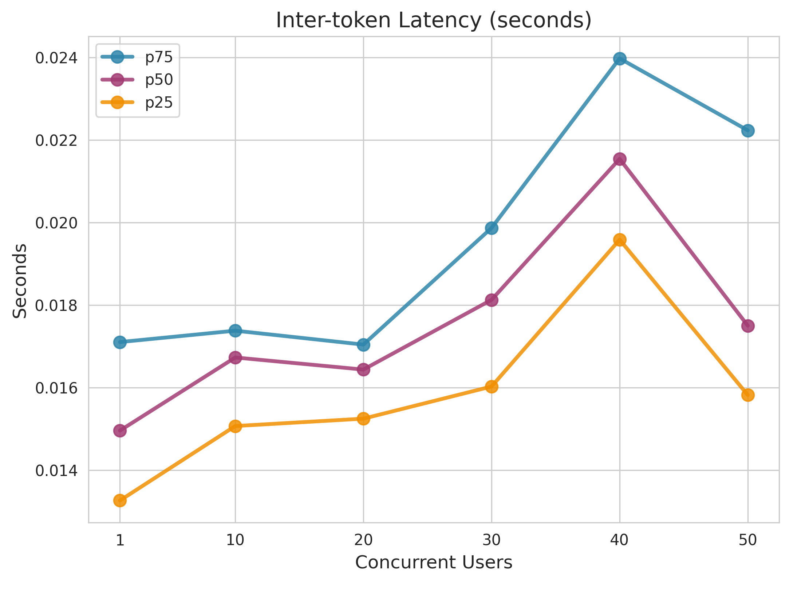
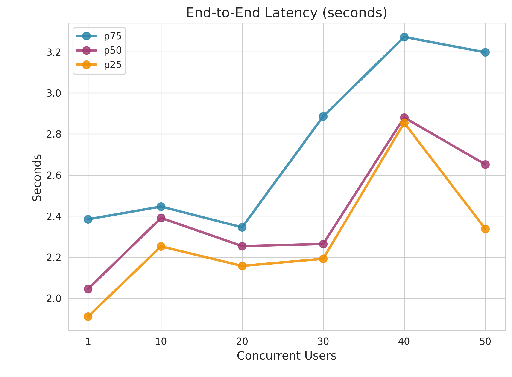
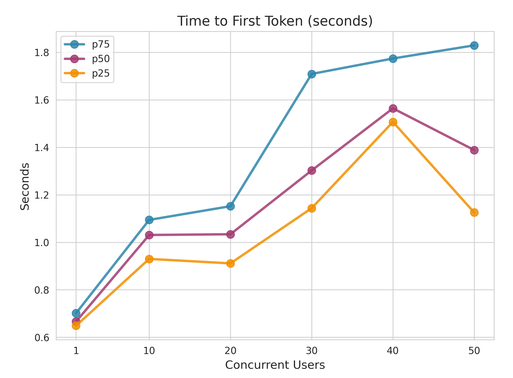
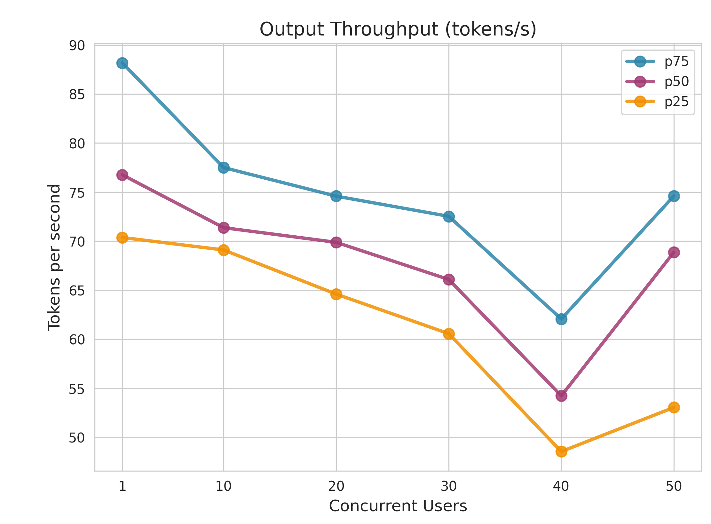
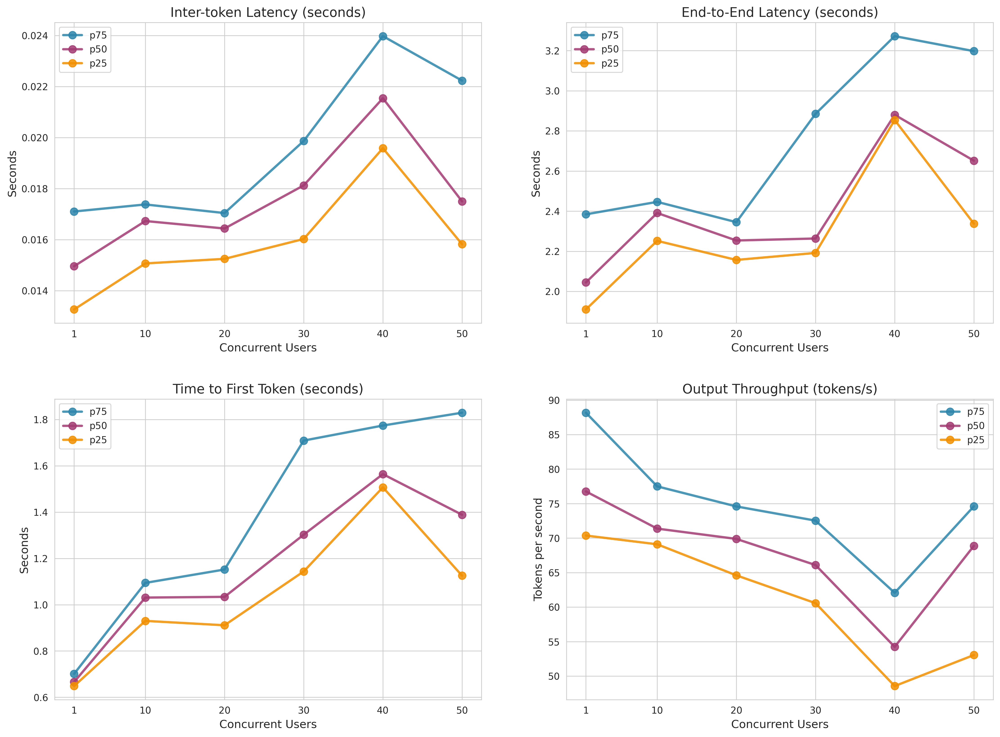

# 效能報告: gpt-4.1-nano

**產生時間:** 2026-01-20 17:20:14

---

## 1. 指標說明

以下圖表說明 LLM 推論過程中測量的關鍵效能指標：

### 關鍵指標說明

- **首 Token 延遲 (TTFT)**: 從發送查詢到收到第一個 token 所經過的時間。此指標衡量初始回應延遲，對於使用者感知的回應性至關重要。

- **Token 間延遲 (ITL)**: 生成過程中連續 token 之間的時間間隔。較低的 ITL 意味著更流暢的串流輸出和更好的文字生成使用者體驗。

- **端到端延遲**: 從發送查詢到收到完整回應的總時間。這包括 TTFT 加上整個生成時間。

- **輸出吞吐量**: 每秒生成的 token 數量。較高的吞吐量表示更好的生成效率。

---

## 2. 效能測試指標

### 端到端延遲（秒）

| Concurrent_Users | P25 | P50 | P75 |
| --- | --- | --- | --- |
| 1.0 | 1.910143459994288 | 2.0447643189982045 | 2.384348967243568 |
| 10.0 | 2.2521830527621205 | 2.3909372779889964 | 2.4463850284955697 |
| 20.0 | 2.157044024002971 | 2.253900204988895 | 2.345254250270955 |
| 30.0 | 2.1919272652594373 | 2.2637948189949384 | 2.885032728248916 |
| 40.0 | 2.854325293243164 | 2.880178278501262 | 3.27257186226052 |
| 50.0 | 2.337871892756084 | 2.651674034015741 | 3.1977333912509494 |

### Token 間延遲（秒）

| Concurrent_Users | P25 | P50 | P75 |
| --- | --- | --- | --- |
| 1.0 | 0.0132686327579679 | 0.0149612314762473 | 0.0171051151647521 |
| 10.0 | 0.015071772179588 | 0.0167318273125551 | 0.0173806679427816 |
| 20.0 | 0.0152503147833605 | 0.0164389726032754 | 0.0170438652199301 |
| 30.0 | 0.0160286063051561 | 0.0181277437980175 | 0.0198675112614473 |
| 40.0 | 0.0195840759215382 | 0.0215395855205132 | 0.0239735572384809 |
| 50.0 | 0.015823065669405 | 0.0175024055947131 | 0.02223098715189 |

### 首 Token 延遲（秒）

| Concurrent_Users | P25 | P50 | P75 |
| --- | --- | --- | --- |
| 1.0 | 0.6486241279853857 | 0.6660815749928588 | 0.7013960607582703 |
| 10.0 | 0.930048490750778 | 1.030747970493394 | 1.0942140535116778 |
| 20.0 | 0.9111654242296936 | 1.0338662905123783 | 1.1519768864891375 |
| 30.0 | 1.143632794490259 | 1.3023681880004006 | 1.708811307507858 |
| 40.0 | 1.506867636497191 | 1.563882073503919 | 1.7737650232520537 |
| 50.0 | 1.125360481259122 | 1.3883890850120224 | 1.829136329251924 |

### 輸出吞吐量（tokens/s）

| Concurrent_Users | P25 | P50 | P75 |
| --- | --- | --- | --- |
| 1.0 | 70.37312057245386 | 76.76272752890614 | 88.17184415207721 |
| 10.0 | 69.10558809406149 | 71.37523767567816 | 77.49988888783271 |
| 20.0 | 64.60594945964684 | 69.88245634760457 | 74.58969540091333 |
| 30.0 | 60.57547082653018 | 66.09828748729258 | 72.53284072513087 |
| 40.0 | 48.55916004326311 | 54.23750477860756 | 62.06928705103281 |
| 50.0 | 53.05398936278283 | 68.86978218702049 | 74.6058830315296 |

---

## 3. 併發效能視覺化

### Token 間延遲（秒）

### 端到端延遲（秒）

### 首 Token 延遲（秒）

### 輸出吞吐量（tokens/s）

---

## 完整效能圖表

