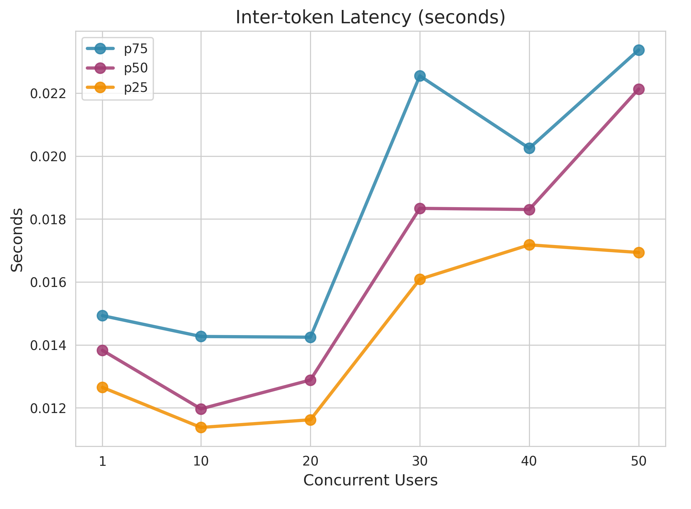
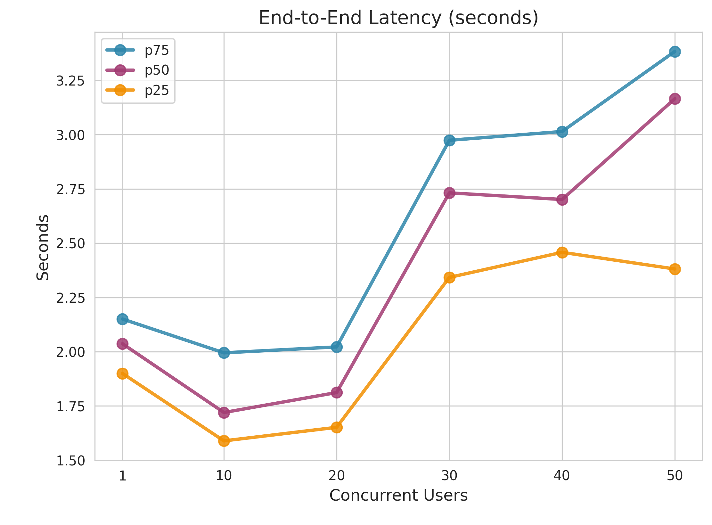
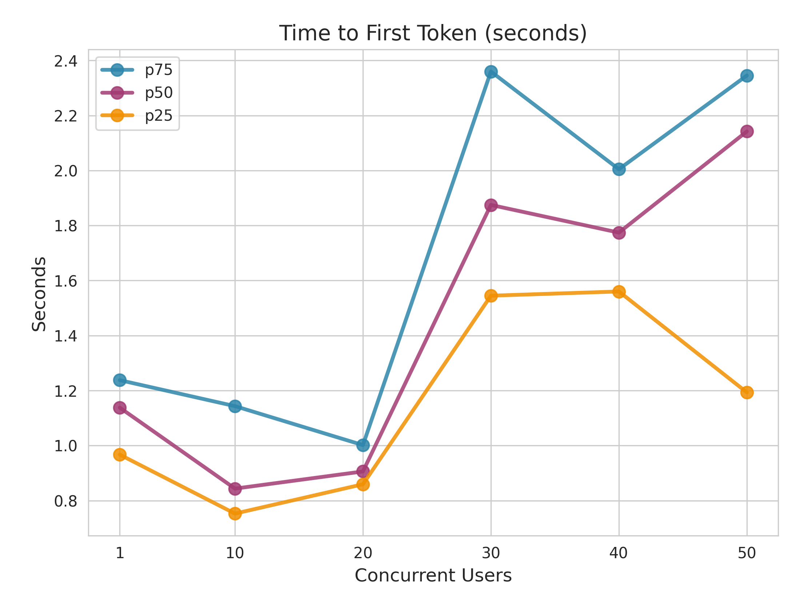
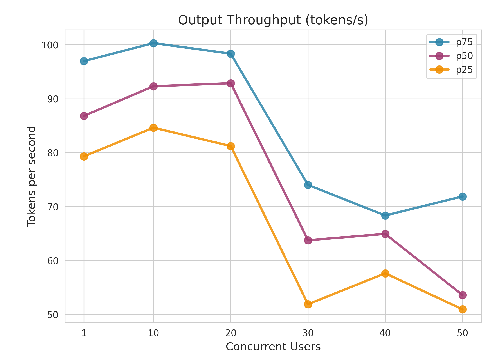
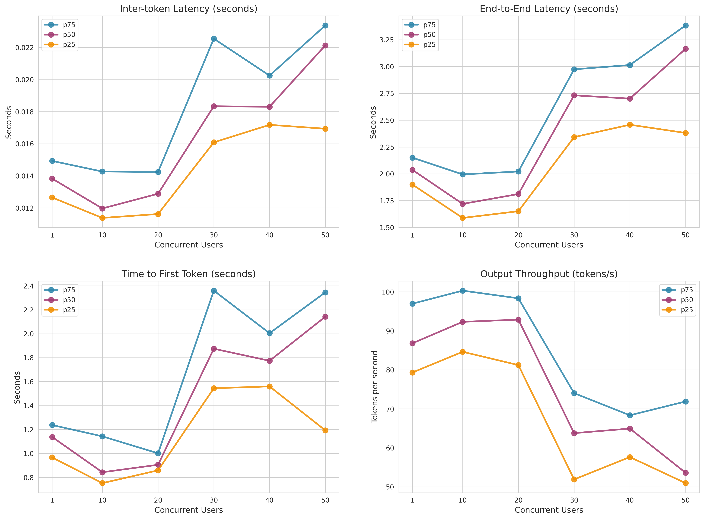

# Performance Report: gpt-4.1-nano

**Generated:** 2026-01-21 11:58:15

---

## 1. Metrics Description

The following diagram illustrates the key performance metrics measured during LLM inference:

### Key Metrics Explained

- **Time to First Token (TTFT)**: The time elapsed from when the query is sent until the first token is received. This measures the initial response latency and is critical for user-perceived responsiveness.

- **Inter-token Latency (ITL)**: The time between consecutive tokens during generation. Lower ITL means smoother streaming output and better user experience during text generation.

- **End-to-End Latency**: The total time from sending the query to receiving the complete response. This includes TTFT plus the entire generation time.

- **Output Throughput**: The number of tokens generated per second. Higher throughput indicates better generation efficiency.

---

## 2. Performance Testing Metrics

### End-to-End Latency (seconds)

| Concurrent_Users | P25 | P50 | P75 |
| --- | --- | --- | --- |
| 1.0 | 1.89977046099375 | 2.036520919005852 | 2.1505422909831395 |
| 10.0 | 1.5889466237422312 | 1.7197263575071702 | 1.9947239534958496 |
| 20.0 | 1.6514914970030077 | 1.811690599002759 | 2.021985123261402 |
| 30.0 | 2.342322192758729 | 2.7318581875006203 | 2.974169112749223 |
| 40.0 | 2.457890984747792 | 2.7013222855021013 | 3.0145109689983656 |
| 50.0 | 2.381103587737016 | 3.1655184219853254 | 3.383487688493915 |

### Inter-token Latency (seconds)

| Concurrent_Users | P25 | P50 | P75 |
| --- | --- | --- | --- |
| 1.0 | 0.0126508453742339 | 0.0138275988867126 | 0.0149313821924592 |
| 10.0 | 0.0113780018628516 | 0.0119681820169551 | 0.0142688532962522 |
| 20.0 | 0.0116213694205675 | 0.012885467814297 | 0.0142457203657574 |
| 30.0 | 0.0160888674628952 | 0.0183400480674302 | 0.0225509060186385 |
| 40.0 | 0.0171812150474038 | 0.0183047159591694 | 0.0202504750376455 |
| 50.0 | 0.0169391897452613 | 0.0221327757143472 | 0.023376956289511 |

### Time to First Token (seconds)

| Concurrent_Users | P25 | P50 | P75 |
| --- | --- | --- | --- |
| 1.0 | 0.9669832505023804 | 1.1378382524999324 | 1.237718753000081 |
| 10.0 | 0.7526089035018231 | 0.8434586324874545 | 1.143347034987528 |
| 20.0 | 0.859295843016298 | 0.9058422554953722 | 1.0016778430144768 |
| 30.0 | 1.5448855862487108 | 1.874888237507548 | 2.360069103742717 |
| 40.0 | 1.56023420351994 | 1.7742334590002429 | 2.004639164013497 |
| 50.0 | 1.1933220705032 | 2.142081361002056 | 2.3454587170053856 |

### Output Throughput (tokens/s)

| Concurrent_Users | P25 | P50 | P75 |
| --- | --- | --- | --- |
| 1.0 | 79.33102861624354 | 86.82220844878117 | 96.9757797298277 |
| 10.0 | 84.6351076796994 | 92.31615130149557 | 100.31634457902608 |
| 20.0 | 81.22760569465565 | 92.8829832314855 | 98.34838459157832 |
| 30.0 | 51.90470335646684 | 63.77442480167439 | 74.02404219335904 |
| 40.0 | 57.64365496051154 | 64.94521808155864 | 68.35527681447377 |
| 50.0 | 50.95796282840388 | 53.61665276372672 | 71.89699790708858 |

---

## 3. Concurrent Performance Visualization

### Inter-token Latency (seconds)

### End-to-End Latency (seconds)

### Time to First Token (seconds)

### Output Throughput (tokens/s)

---

## Full Performance Chart

