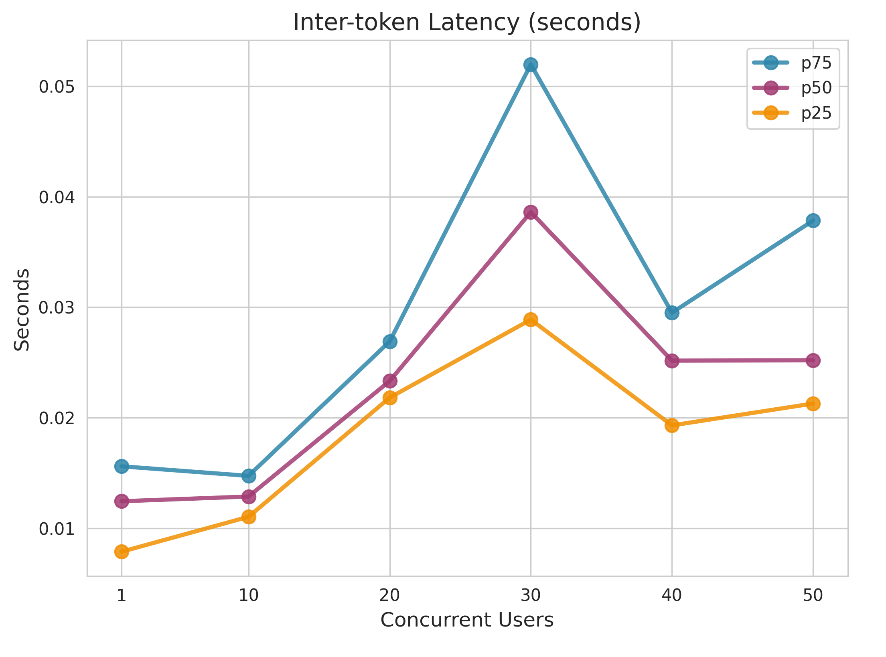
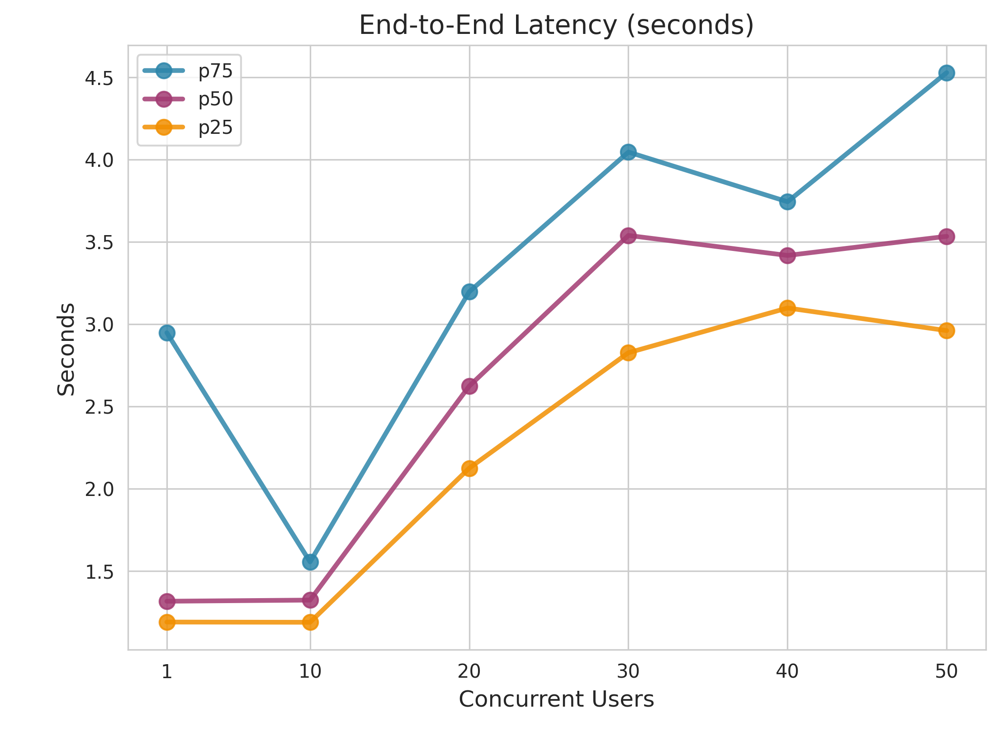
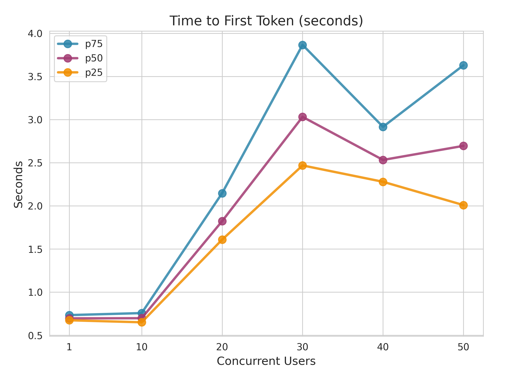
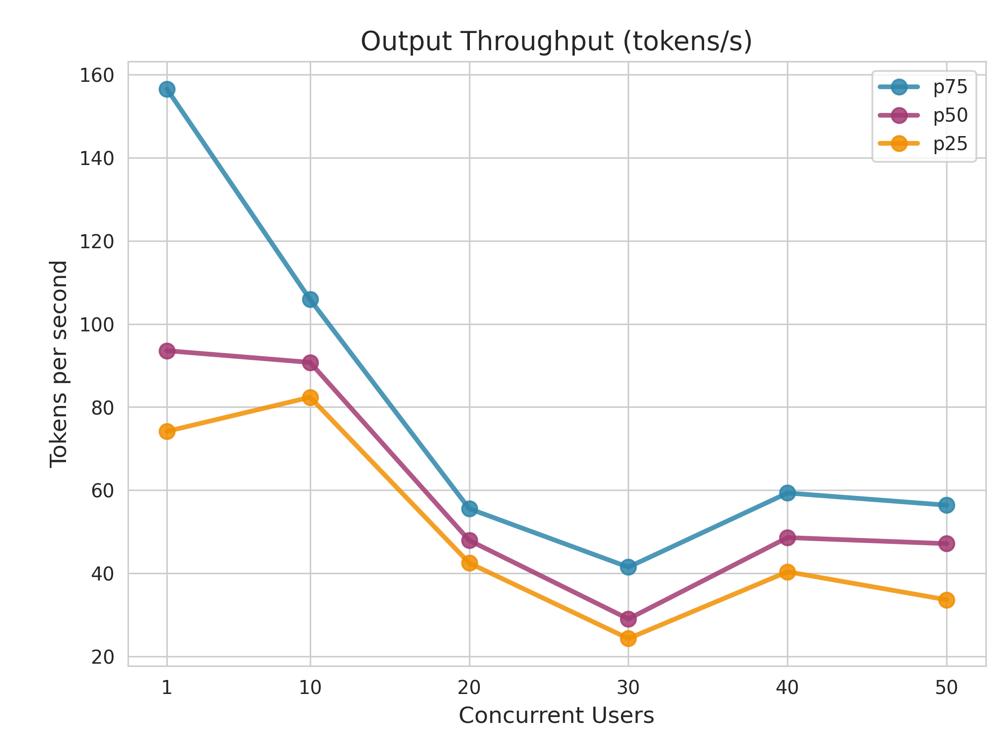

# Performance Report: gpt-4.1-nano

**Generated:** 2026-01-22 11:48:11

---

## 1. Metrics Description

The following diagram illustrates the key performance metrics measured during LLM inference:

### Key Metrics Explained

- **Time to First Token (TTFT)**: The time elapsed from when the query is sent until the first token is received. This measures the initial response latency and is critical for user-perceived responsiveness.

- **Inter-token Latency (ITL)**: The time between consecutive tokens during generation. Lower ITL means smoother streaming output and better user experience during text generation.

- **End-to-End Latency**: The total time from sending the query to receiving the complete response. This includes TTFT plus the entire generation time.

- **Output Throughput**: The number of tokens generated per second. Higher throughput indicates better generation efficiency.

---

## 2. Performance Testing Metrics

### End-to-End Latency (seconds)

| Concurrent_Users | P25 | P50 | P75 |
| --- | --- | --- | --- |
| 1.0 | 1.190245484787738 | 1.3166866784740705 | 2.947646807762794 |
| 10.0 | 1.1889416299964068 | 1.3236683614959477 | 1.5555294967343798 |
| 20.0 | 2.124873763517826 | 2.6234263440128416 | 3.196236008501728 |
| 30.0 | 2.8260417537676403 | 3.538461047457531 | 4.044892530000652 |
| 40.0 | 3.0977143637574045 | 3.417032499506604 | 3.743074554993655 |
| 50.0 | 2.9604869162430987 | 3.5331342094868887 | 4.527421891500126 |

### Inter-token Latency (seconds)

| Concurrent_Users | P25 | P50 | P75 |
| --- | --- | --- | --- |
| 1.0 | 0.0078719469946744 | 0.0124393282236105 | 0.015601684832864 |
| 10.0 | 0.0110317817082562 | 0.0128664281594972 | 0.0147364304869273 |
| 20.0 | 0.0218154105627287 | 0.0233203632429734 | 0.026900481165252 |
| 30.0 | 0.0288758008281872 | 0.0386054814983759 | 0.0519677933890003 |
| 40.0 | 0.0193037416598726 | 0.0251644602445835 | 0.0294985532797818 |
| 50.0 | 0.0212802916682135 | 0.0251919603832228 | 0.0378394297124139 |

### Time to First Token (seconds)

| Concurrent_Users | P25 | P50 | P75 |
| --- | --- | --- | --- |
| 1.0 | 0.6742911122273654 | 0.6963312829902861 | 0.7341118670447031 |
| 10.0 | 0.6506704112398438 | 0.697987934545381 | 0.7573897472466342 |
| 20.0 | 1.608625798515277 | 1.8230021305207629 | 2.147233554496779 |
| 30.0 | 2.4690231327404035 | 3.031943609996233 | 3.866606635012431 |
| 40.0 | 2.2795068730192725 | 2.532802203000756 | 2.916642289463198 |
| 50.0 | 2.0094507412723037 | 2.6959306850039866 | 3.630388737015892 |

### Output Throughput (tokens/s)

| Concurrent_Users | P25 | P50 | P75 |
| --- | --- | --- | --- |
| 1.0 | 74.14779180038789 | 93.5700913145052 | 156.59186045214136 |
| 10.0 | 82.36031872957163 | 90.75170365467326 | 105.88827676592456 |
| 20.0 | 42.45523592560985 | 47.90432500835344 | 55.53874722944269 |
| 30.0 | 24.271554383306068 | 28.992312048164084 | 41.46166816174979 |
| 40.0 | 40.3477091338908 | 48.58051673121503 | 59.31113790964886 |
| 50.0 | 33.60202681533714 | 47.12038158642986 | 56.38616459852759 |

---

## 3. Concurrent Performance Visualization

### Inter-token Latency (seconds)

### End-to-End Latency (seconds)

### Time to First Token (seconds)

### Output Throughput (tokens/s)

---

## Full Performance Chart

