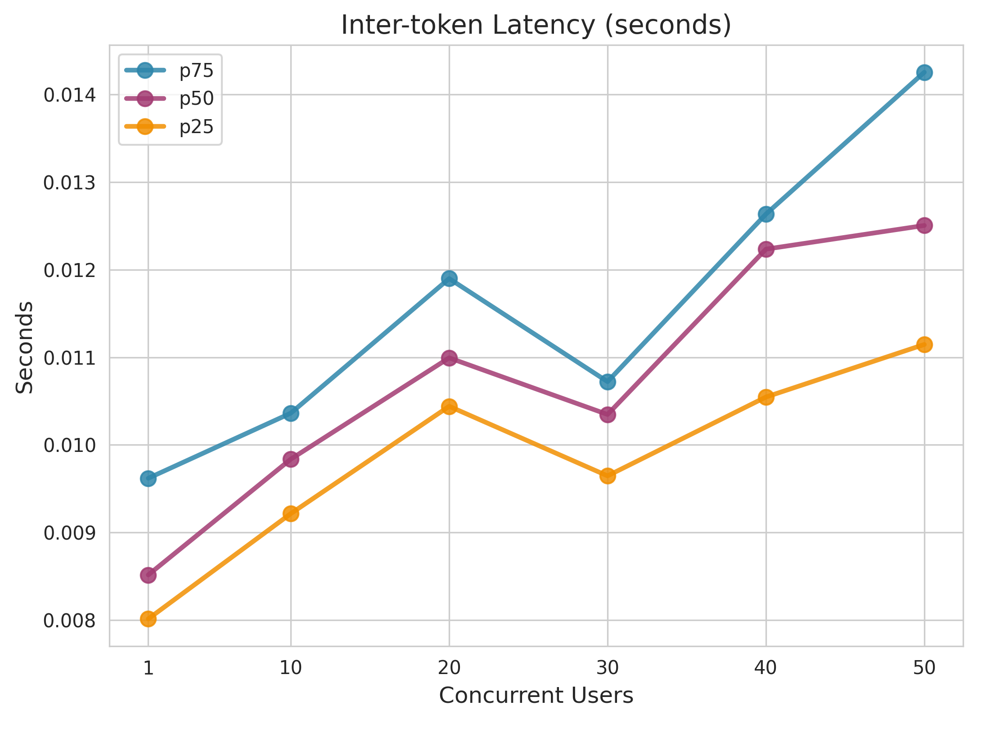
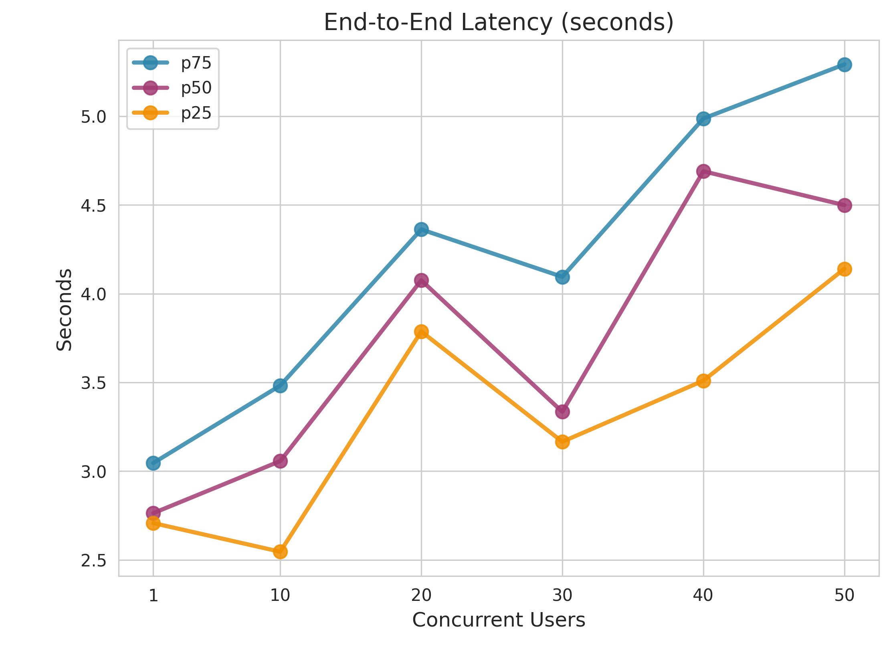
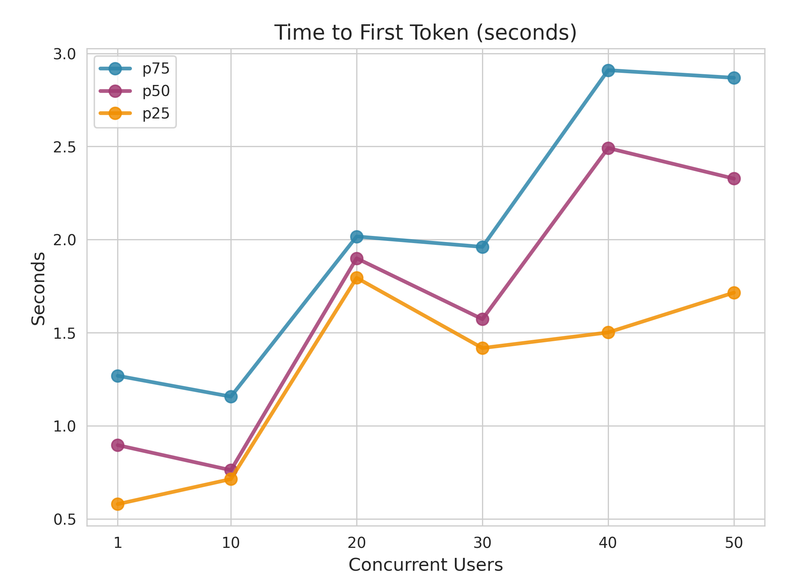
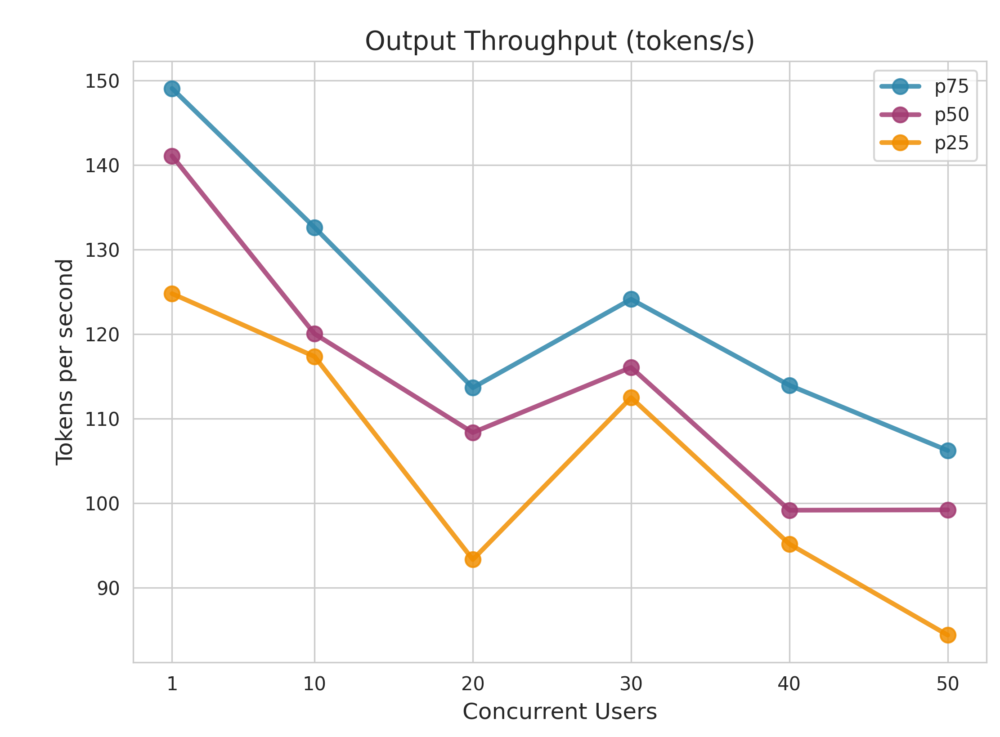

# Performance Report: gpt-4.1-nano

**Generated:** 2026-01-22 11:40:32

---

## 1. Metrics Description

The following diagram illustrates the key performance metrics measured during LLM inference:

### Key Metrics Explained

- **Time to First Token (TTFT)**: The time elapsed from when the query is sent until the first token is received. This measures the initial response latency and is critical for user-perceived responsiveness.

- **Inter-token Latency (ITL)**: The time between consecutive tokens during generation. Lower ITL means smoother streaming output and better user experience during text generation.

- **End-to-End Latency**: The total time from sending the query to receiving the complete response. This includes TTFT plus the entire generation time.

- **Output Throughput**: The number of tokens generated per second. Higher throughput indicates better generation efficiency.

---

## 2. Performance Testing Metrics

### End-to-End Latency (seconds)

| Concurrent_Users | P25 | P50 | P75 |
| --- | --- | --- | --- |
| 1.0 | 2.7078368440270424 | 2.7637554024986457 | 3.0460764037416084 |
| 10.0 | 2.546487183280988 | 3.0568915064795874 | 3.4825491602387046 |
| 20.0 | 3.7869987792655593 | 4.075114364997717 | 4.361715153732803 |
| 30.0 | 3.1659672212408623 | 3.3346234074851964 | 4.094688452008995 |
| 40.0 | 3.509981874245568 | 4.689261998020811 | 4.986383821757045 |
| 50.0 | 4.140073058762937 | 4.498464411008172 | 5.2912253852555295 |

### Inter-token Latency (seconds)

| Concurrent_Users | P25 | P50 | P75 |
| --- | --- | --- | --- |
| 1.0 | 0.0080125266374871 | 0.0085148642686145 | 0.0096184423500889 |
| 10.0 | 0.0092147218494704 | 0.0098366531137709 | 0.0103619680472719 |
| 20.0 | 0.010440394561657 | 0.0109934721742305 | 0.0118985575598644 |
| 30.0 | 0.0096458933052553 | 0.0103469181878172 | 0.0107215662994827 |
| 40.0 | 0.0105458434253587 | 0.0122345354055169 | 0.0126344811724559 |
| 50.0 | 0.0111460377317224 | 0.0125048522860775 | 0.0142545290676375 |

### Time to First Token (seconds)

| Concurrent_Users | P25 | P50 | P75 |
| --- | --- | --- | --- |
| 1.0 | 0.5794694894866552 | 0.8961952369718347 | 1.2686696347518591 |
| 10.0 | 0.7139488747925498 | 0.7617162225069478 | 1.156788881518878 |
| 20.0 | 1.7946465252607595 | 1.8995352740166709 | 2.016684196976712 |
| 30.0 | 1.4174609875044553 | 1.5727059284690768 | 1.960826451031608 |
| 40.0 | 1.5014154542732283 | 2.4915064410306518 | 2.9097467379906448 |
| 50.0 | 1.7151258407684509 | 2.3275053814868443 | 2.8688854137435555 |

### Output Throughput (tokens/s)

| Concurrent_Users | P25 | P50 | P75 |
| --- | --- | --- | --- |
| 1.0 | 124.7777329364944 | 141.06439085392057 | 149.04165767241017 |
| 10.0 | 117.3433621166299 | 120.03144778405483 | 132.60484890907728 |
| 20.0 | 93.33721545701157 | 108.35104913926182 | 113.6498715314195 |
| 30.0 | 112.47919314217025 | 116.05141176949886 | 124.11290896080432 |
| 40.0 | 95.165571700332 | 99.16691840457422 | 113.93809517295932 |
| 50.0 | 84.40129681047333 | 99.20845974896312 | 106.22813314771372 |

---

## 3. Concurrent Performance Visualization

### Inter-token Latency (seconds)

### End-to-End Latency (seconds)

### Time to First Token (seconds)

### Output Throughput (tokens/s)

---

## Full Performance Chart

