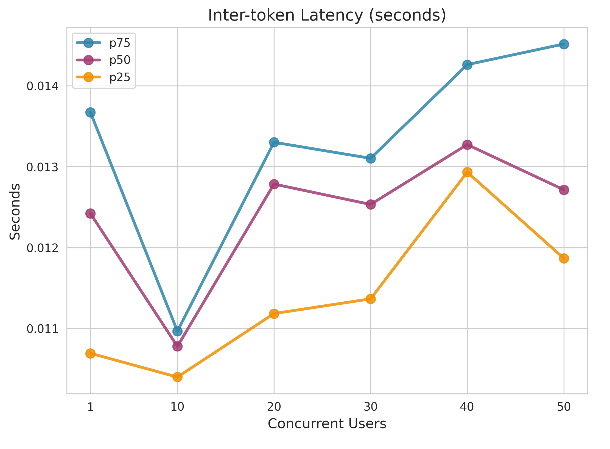
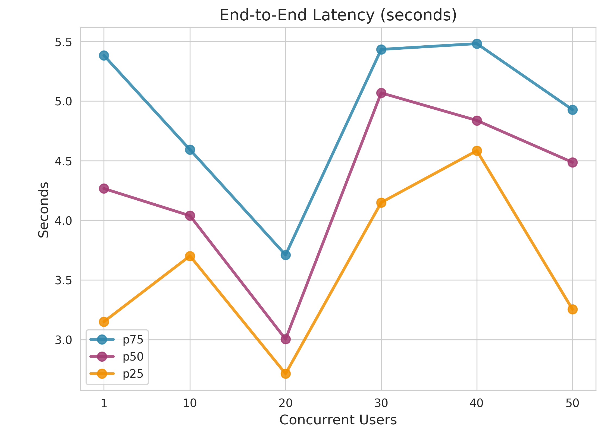
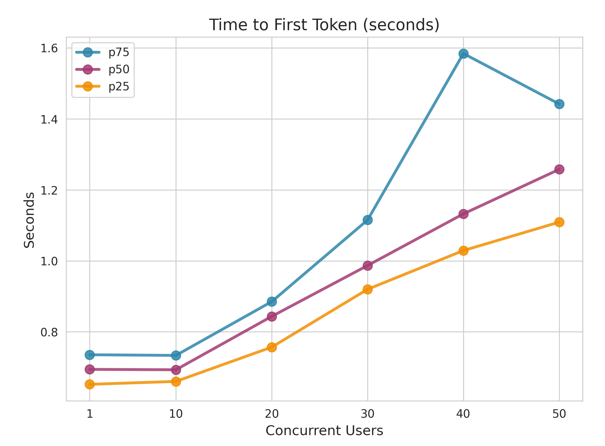
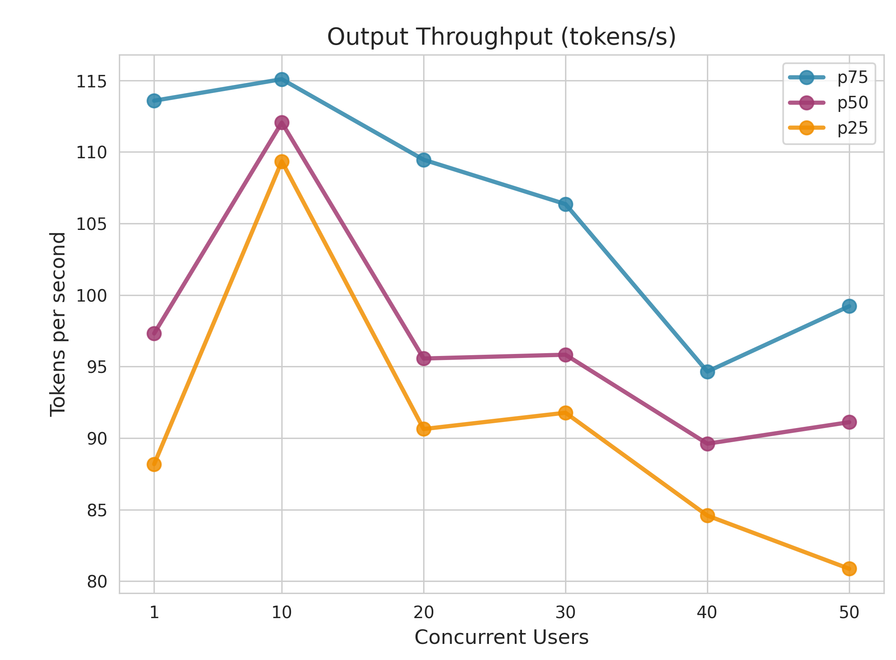

# Performance Report: gpt-4.1-nano

**Generated:** 2026-01-22 14:35:23

---

## Test Configuration

### Use Case: RAG (Retrieval-Augmented Generation)

| Range | Input Tokens | Output Tokens |
|---|---|---|
| Min | 1,000 | 200 |
| Max | 10,000 | 500 |
| **Mean ± Stddev** | **5,500 ± 2,250** | **350 ± 75** |

### Test Settings

- **Cache Prevention**: Prefix caching disabled + Unique prompts enabled for accurate hardware performance measurement

---

## 1. Metrics Description

The following diagram illustrates the key performance metrics measured during LLM inference:

### Key Metrics Explained

- **Time to First Token (TTFT)**: The time elapsed from when the query is sent until the first token is received. This measures the initial response latency and is critical for user-perceived responsiveness.

- **Inter-token Latency (ITL)**: The time between consecutive tokens during generation. Lower ITL means smoother streaming output and better user experience during text generation.

- **End-to-End Latency**: The total time from sending the query to receiving the complete response. This includes TTFT plus the entire generation time.

- **Output Throughput**: The number of tokens generated per second. Higher throughput indicates better generation efficiency.

---

## 2. Performance Testing Metrics

### End-to-End Latency (seconds)

| Concurrent_Users | P25 | P50 | P75 |
| --- | --- | --- | --- |
| 1.0 | 3.150478501716861 | 4.266341507987818 | 5.382318091753405 |
| 10.0 | 3.701770760249929 | 4.038778312009526 | 4.592645956246997 |
| 20.0 | 2.7144735805195523 | 3.0038492624880746 | 3.7100733647384914 |
| 30.0 | 4.149410884259851 | 5.068070256500505 | 5.4327687795012025 |
| 40.0 | 4.583897239266662 | 4.8373624944943 | 5.481201244518161 |
| 50.0 | 3.2543411445221864 | 4.486468444025377 | 4.927801498983172 |

### Inter-token Latency (seconds)

| Concurrent_Users | P25 | P50 | P75 |
| --- | --- | --- | --- |
| 1.0 | 0.0106917746035597 | 0.0124210774547224 | 0.013672825607061 |
| 10.0 | 0.0103980310796431 | 0.0107775668369032 | 0.0109657206315849 |
| 20.0 | 0.0111834110333997 | 0.0127849787662443 | 0.0133019048129701 |
| 30.0 | 0.0113653192248522 | 0.0125329775549231 | 0.0131035148464716 |
| 40.0 | 0.0129324347516905 | 0.0132735373628043 | 0.0142623826845904 |
| 50.0 | 0.0118666300857269 | 0.0127145584157899 | 0.0145173537500271 |

### Time to First Token (seconds)

| Concurrent_Users | P25 | P50 | P75 |
| --- | --- | --- | --- |
| 1.0 | 0.6520802329760045 | 0.6942514264665078 | 0.7354302447201917 |
| 10.0 | 0.6603029567486374 | 0.6931429534743074 | 0.733622710526106 |
| 20.0 | 0.7569498244993156 | 0.8436112865165342 | 0.8852122115204111 |
| 30.0 | 0.9199413782625924 | 0.9869142094976268 | 1.1152081287291369 |
| 40.0 | 1.0291054122353671 | 1.1325202489970252 | 1.5844032435270492 |
| 50.0 | 1.1091555522434646 | 1.2579169335076583 | 1.4421191079745768 |

### Output Throughput (tokens/s)

| Concurrent_Users | P25 | P50 | P75 |
| --- | --- | --- | --- |
| 1.0 | 88.17810521395211 | 97.30838745081644 | 113.5770472660347 |
| 10.0 | 109.3390541755828 | 112.04830495730494 | 115.08249348764754 |
| 20.0 | 90.63047382114574 | 95.56019285768193 | 109.452436342662 |
| 30.0 | 91.76993064902604 | 95.82459978287994 | 106.35145296749846 |
| 40.0 | 84.58142696969672 | 89.60651901042482 | 94.645930593785 |
| 50.0 | 80.86646566227213 | 91.10822202110964 | 99.2138848794348 |

---

## 3. Concurrent Performance Visualization

### Inter-token Latency (seconds)

### End-to-End Latency (seconds)

### Time to First Token (seconds)

### Output Throughput (tokens/s)

---

## Full Performance Chart

