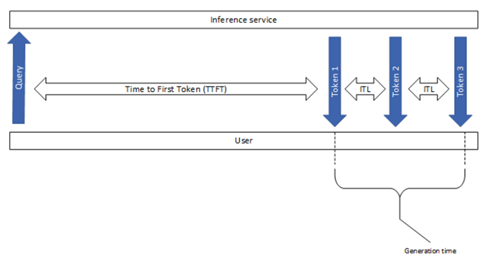
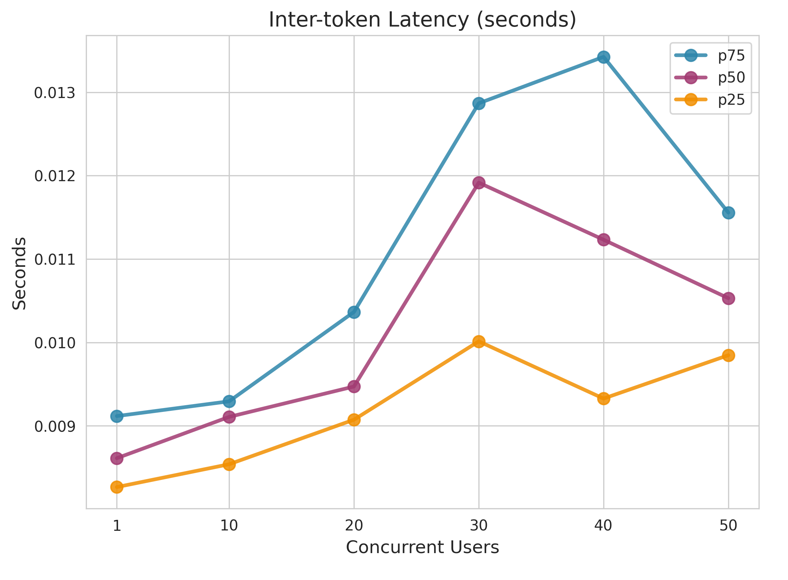
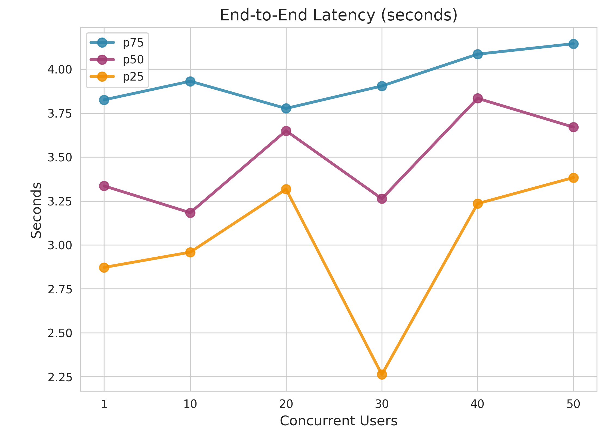
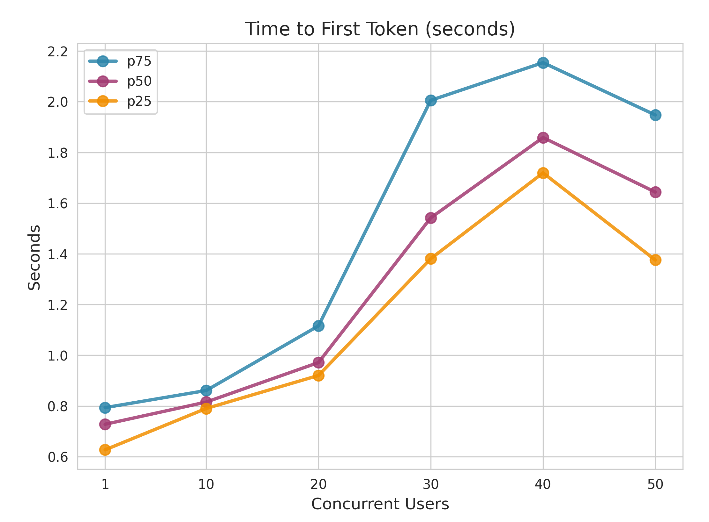
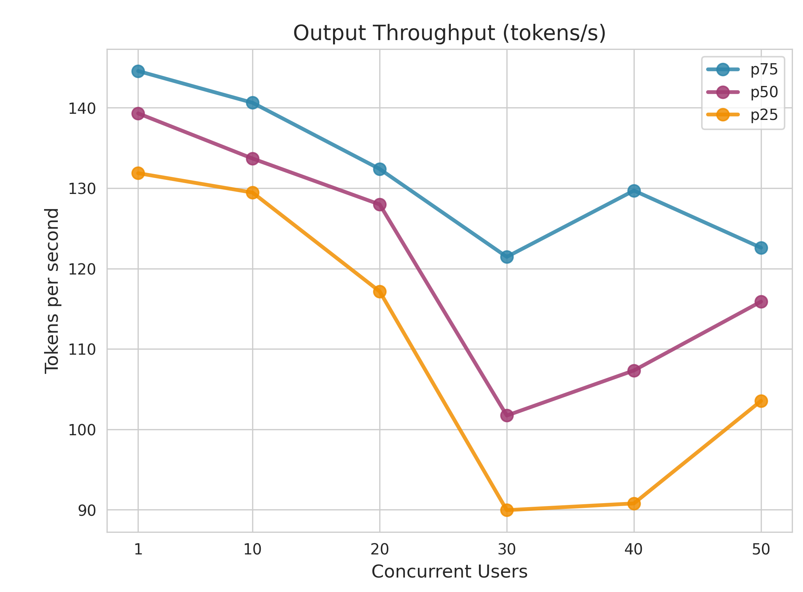
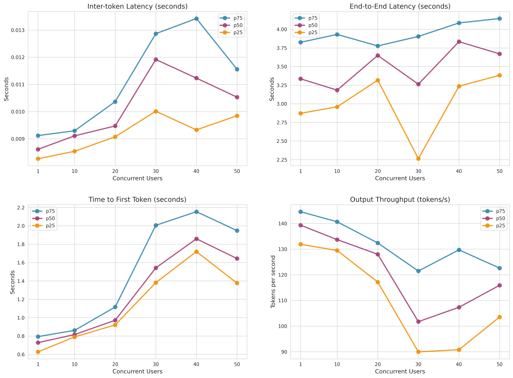

# Performance Report: gpt-4.1-nano

**Generated:** 2026-01-22 15:03:58

---

## Test Configuration

### Use Case: RAG (Retrieval-Augmented Generation)

| Range | Input Tokens | Output Tokens |
|---|---|---|
| Min | 1,000 | 200 |
| Max | 10,000 | 500 |
| **Mean ± Stddev** | **5,500 ± 2,250** | **350 ± 75** |

### Test Settings

- **Cache Prevention**: Prefix caching disabled + Unique prompts enabled for accurate hardware performance measurement

---

## 1. Metrics Description

The following diagram illustrates the key performance metrics measured during LLM inference:

### Key Metrics Explained

- **Time to First Token (TTFT)**: The time elapsed from when the query is sent until the first token is received. This measures the initial response latency and is critical for user-perceived responsiveness.

- **Inter-token Latency (ITL)**: The time between consecutive tokens during generation. Lower ITL means smoother streaming output and better user experience during text generation.

- **End-to-End Latency**: The total time from sending the query to receiving the complete response. This includes TTFT plus the entire generation time.

- **Output Throughput**: The number of tokens generated per second. Higher throughput indicates better generation efficiency.

---

## 2. Performance Testing Metrics

### End-to-End Latency (seconds)

| Concurrent_Users | P25 | P50 | P75 |
| --- | --- | --- | --- |
| 1.0 | 2.872032201732509 | 3.3357553580135573 | 3.825649152480764 |
| 10.0 | 2.9587796677660663 | 3.1832303980190773 | 3.9314752555219457 |
| 20.0 | 3.3174200810026377 | 3.649654527020175 | 3.776746044473839 |
| 30.0 | 2.2623437832517084 | 3.26296947101946 | 3.904548959006206 |
| 40.0 | 3.2352358352654846 | 3.834122125525028 | 4.085583016989403 |
| 50.0 | 3.3832838132511824 | 3.670370672480203 | 4.145015772752231 |

### Inter-token Latency (seconds)

| Concurrent_Users | P25 | P50 | P75 |
| --- | --- | --- | --- |
| 1.0 | 0.0082658407772226 | 0.0086120431904769 | 0.0091169198360609 |
| 10.0 | 0.0085394689180396 | 0.0091073938208483 | 0.0092940613888354 |
| 20.0 | 0.0090734572527275 | 0.0094712784851224 | 0.0103651712528776 |
| 30.0 | 0.0100128765996068 | 0.011915750151568 | 0.0128668339196021 |
| 40.0 | 0.0093270238183784 | 0.0112313848767877 | 0.013423926608948 |
| 50.0 | 0.0098467784731015 | 0.010530159019714 | 0.0115560855994282 |

### Time to First Token (seconds)

| Concurrent_Users | P25 | P50 | P75 |
| --- | --- | --- | --- |
| 1.0 | 0.6270338134781923 | 0.7278219820000231 | 0.7934727527317591 |
| 10.0 | 0.790099587480654 | 0.8153579639911186 | 0.8609782429994084 |
| 20.0 | 0.9203534365078668 | 0.9712824464950244 | 1.1158812224894064 |
| 30.0 | 1.3809845607320312 | 1.5419791614986025 | 2.0054584065364907 |
| 40.0 | 1.719230391230667 | 1.8587102715100627 | 2.154113052529283 |
| 50.0 | 1.375505306525156 | 1.6434117619937751 | 1.947674176495639 |

### Output Throughput (tokens/s)

| Concurrent_Users | P25 | P50 | P75 |
| --- | --- | --- | --- |
| 1.0 | 131.86526908394612 | 139.3038169158645 | 144.57168871010558 |
| 10.0 | 129.45581172471145 | 133.68713759363155 | 140.6259879136245 |
| 20.0 | 117.15873734462068 | 127.9787449501264 | 132.38796644866682 |
| 30.0 | 89.95609264464333 | 101.72347283347608 | 121.45645894006704 |
| 40.0 | 90.79051167239555 | 107.32981603439444 | 129.70225365928246 |
| 50.0 | 103.54479235326662 | 115.89357068068398 | 122.59606098714085 |

---

## 3. Concurrent Performance Visualization

### Inter-token Latency (seconds)

### End-to-End Latency (seconds)

### Time to First Token (seconds)

### Output Throughput (tokens/s)

---

## Full Performance Chart

