# Performance Report: gpt-4.1-nano

**Generated:** 2026-01-27 13:15:32

---

## 1. Metrics Description

The following diagram illustrates the key performance metrics measured during LLM inference:

### Key Metrics Explained

- **Time to First Token (TTFT)**: The time elapsed from when the query is sent until the first token is received. This measures the initial response latency and is critical for user-perceived responsiveness.

- **Inter-token Latency (ITL)**: The time between consecutive tokens during generation. Lower ITL means smoother streaming output and better user experience during text generation.

- **End-to-End Latency**: The total time from sending the query to receiving the complete response. This includes TTFT plus the entire generation time.

- **Output Throughput**: The number of tokens generated per second. Higher throughput indicates better generation efficiency.

---

## 2. Use Case: RAG (Retrieval-Augmented Generation)

### Test Configuration

| Range | Input Tokens | Output Tokens |
|---|---|---|
| Min | 1,000 | 200 |
| Max | 10,000 | 500 |
| **Mean ± Stddev** | **5,500 ± 2,250** | **350 ± 75** |

- **Cache Prevention**: Prefix caching disabled + Unique prompts enabled for accurate hardware performance measurement

### Performance Metrics

#### End-to-End Latency (seconds)

| Concurrent_Users | P25 | P50 | P75 |
| --- | --- | --- | --- |
| 1.0 | 3.4337410385087423 | 3.7121899129997473 | 3.847544917007326 |
| 10.0 | 3.2110196400062705 | 3.823620085997391 | 4.253939378751966 |
| 20.0 | 2.895735965750646 | 3.30636972150387 | 3.425928412754729 |
| 30.0 | 3.425562801752676 | 3.47380790799798 | 3.770280266249756 |
| 40.0 | 2.582983700245677 | 3.5234643784933724 | 4.010577156252111 |
| 50.0 | 2.9672956974973204 | 3.0128286175022367 | 3.2485296664999623 |

#### Inter-token Latency (seconds)

| Concurrent_Users | P25 | P50 | P75 |
| --- | --- | --- | --- |
| 1.0 | 0.00979935402752 | 0.0104701153025659 | 0.0110006514356847 |
| 10.0 | 0.0097547336803745 | 0.0103924245882987 | 0.0110919036284873 |
| 20.0 | 0.0095175629963731 | 0.0101191367902867 | 0.0102358825392815 |
| 30.0 | 0.0116404080277751 | 0.0139751577152247 | 0.0157395748518606 |
| 40.0 | 0.0094953760116442 | 0.0102674396584885 | 0.011363459385064 |
| 50.0 | 0.0100681737300476 | 0.0109131307632005 | 0.0115854356976836 |

#### Time to First Token (seconds)

| Concurrent_Users | P25 | P50 | P75 |
| --- | --- | --- | --- |
| 1.0 | 0.5725689789978787 | 0.6508005980067537 | 0.7689732452527096 |
| 10.0 | 0.4581951372456387 | 0.4835063155042007 | 0.6115676972440269 |
| 20.0 | 0.4159213379971334 | 0.4962146449979627 | 0.5359799915058829 |
| 30.0 | 1.3277997044933727 | 1.3676909804999011 | 1.5556978699933095 |
| 40.0 | 0.4634263214975362 | 0.5300275960034924 | 0.6298360792461608 |
| 50.0 | 0.5380722339978092 | 0.5803135424939683 | 0.6263126634949003 |

#### Output Throughput (tokens/s)

| Concurrent_Users | P25 | P50 | P75 |
| --- | --- | --- | --- |
| 1.0 | 110.71610010130996 | 115.11020766169985 | 122.45249416081046 |
| 10.0 | 108.18053153248232 | 114.28291791437292 | 121.58471631834908 |
| 20.0 | 117.6653095687921 | 118.95536598741582 | 126.1821298337106 |
| 30.0 | 76.65367450354971 | 88.7353825072222 | 104.55552245145395 |
| 40.0 | 107.25988530750736 | 116.89223579212197 | 127.24921984703458 |
| 50.0 | 105.2726956015906 | 111.4095924851325 | 115.2820544410662 |

### Performance Charts

#### Inter-token Latency (seconds)
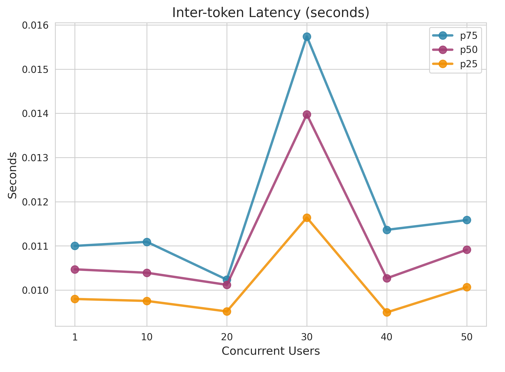

#### End-to-End Latency (seconds)
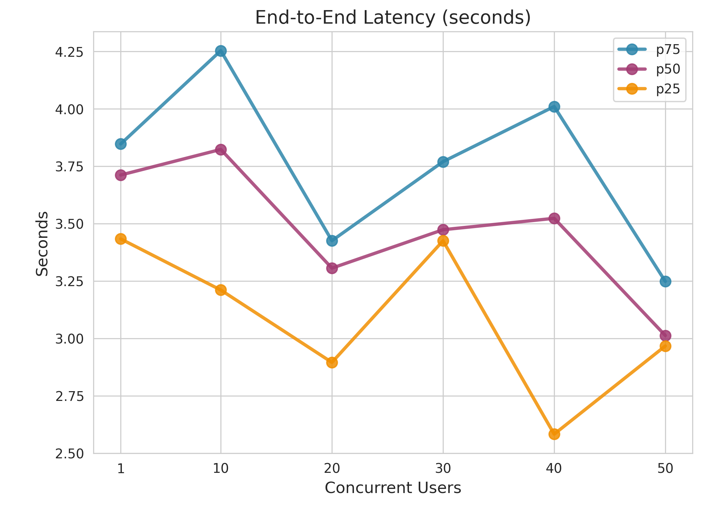

#### Time to First Token (seconds)
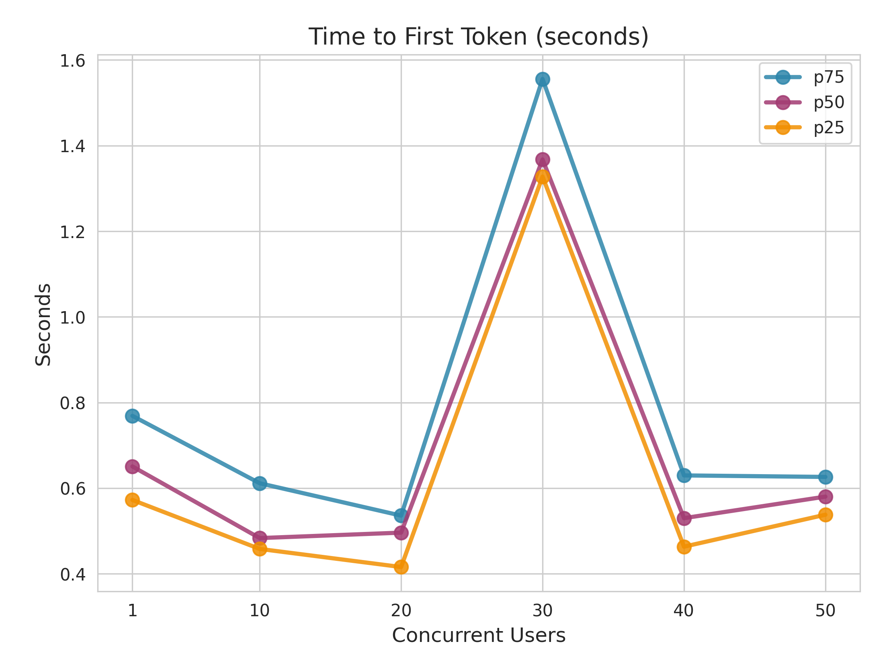

#### Output Throughput (tokens/s)
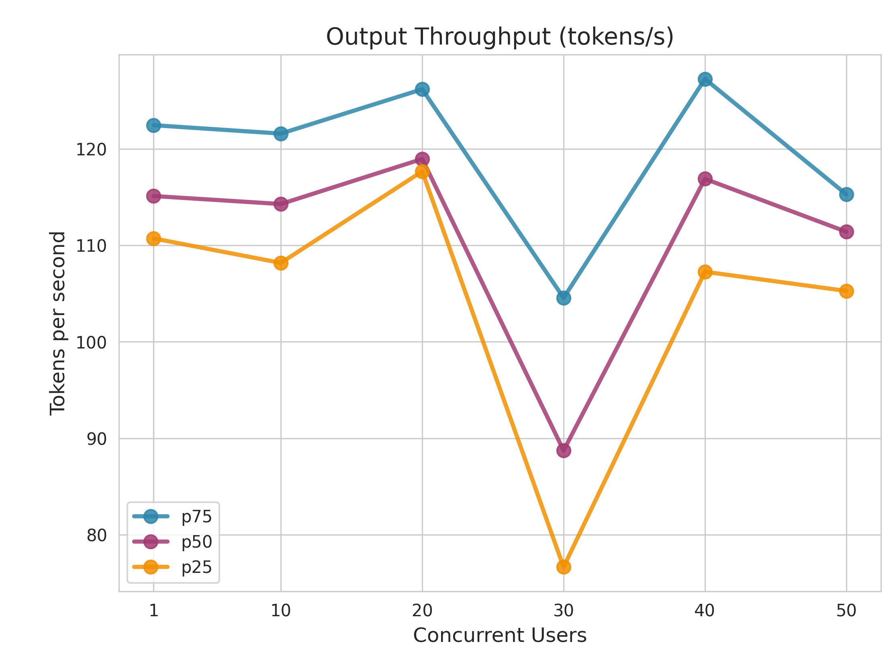

#### Full Performance Chart

---

## 3. Use Case: Text Generation

### Test Configuration

| Range | Input Tokens | Output Tokens |
|---|---|---|
| Min | 100 | 1,000 |
| Max | 200 | 10,000 |
| **Mean ± Stddev** | **150 ± 25** | **5,500 ± 2,250** |

- **Cache Prevention**: Prefix caching disabled + Unique prompts enabled for accurate hardware performance measurement

### Performance Metrics

#### End-to-End Latency (seconds)

| Concurrent_Users | P25 | P50 | P75 |
| --- | --- | --- | --- |
| 1.0 | 1.140907733253698 | 1.5593092380004236 | 2.0084340865032573 |
| 10.0 | 1.3166543902552803 | 1.4146161815078813 | 1.7336164845037274 |
| 20.0 | 1.0921160625002813 | 1.2490535754986922 | 1.5052125395013718 |
| 30.0 | 1.323068315748969 | 1.3506592464909772 | 1.4092698692547856 |
| 40.0 | 1.0761673752494971 | 1.1495720609964335 | 1.288387706499634 |
| 50.0 | 1.4160438619983324 | 1.5414153599922429 | 2.281757492746692 |

#### Inter-token Latency (seconds)

| Concurrent_Users | P25 | P50 | P75 |
| --- | --- | --- | --- |
| 1.0 | 0.0111479445821357 | 0.0125792340765328 | 0.0145417778079848 |
| 10.0 | 0.0122547010747549 | 0.0142606673148532 | 0.015113378592856 |
| 20.0 | 0.0131040924387143 | 0.0146340445191771 | 0.0168590822328042 |
| 30.0 | 0.0126642303706338 | 0.0132080331536113 | 0.0145586447691492 |
| 40.0 | 0.0107606211288989 | 0.0118518200300024 | 0.0127570254731416 |
| 50.0 | 0.0155682071647672 | 0.0197155121667638 | 0.0275490016245105 |

#### Time to First Token (seconds)

| Concurrent_Users | P25 | P50 | P75 |
| --- | --- | --- | --- |
| 1.0 | 0.4493283744996006 | 0.4689902540048933 | 0.5267735682464263 |
| 10.0 | 0.4567582667441456 | 0.5176539145031711 | 0.5871687534963712 |
| 20.0 | 0.5017835432445281 | 0.5528326814965112 | 0.5778546627552714 |
| 30.0 | 0.5008295807492686 | 0.5884271500035538 | 0.680393198505044 |
| 40.0 | 0.4354654865055636 | 0.4832093805016484 | 0.5215527742475388 |
| 50.0 | 0.5834957677470811 | 0.8468492765023257 | 1.0224736467425828 |

#### Output Throughput (tokens/s)

| Concurrent_Users | P25 | P50 | P75 |
| --- | --- | --- | --- |
| 1.0 | 81.43540254562518 | 93.419401777503 | 106.2891221570751 |
| 10.0 | 77.76872035130427 | 86.77162190093662 | 96.54075200947015 |
| 20.0 | 67.02349462109754 | 82.23439768934924 | 94.67750696706278 |
| 30.0 | 81.60183845187142 | 89.97511230204981 | 93.77029369848626 |
| 40.0 | 89.5500536248607 | 99.60808343060592 | 109.9623407504636 |
| 50.0 | 41.12404421746909 | 58.16777453782717 | 75.9384881030967 |

### Performance Charts

#### Inter-token Latency (seconds)
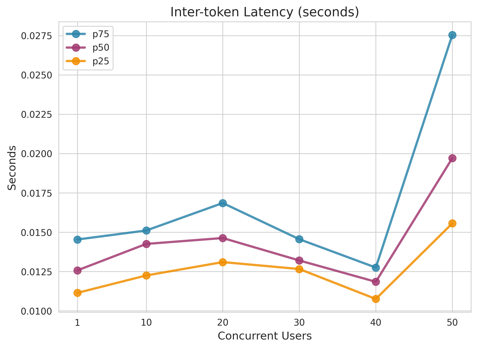

#### End-to-End Latency (seconds)
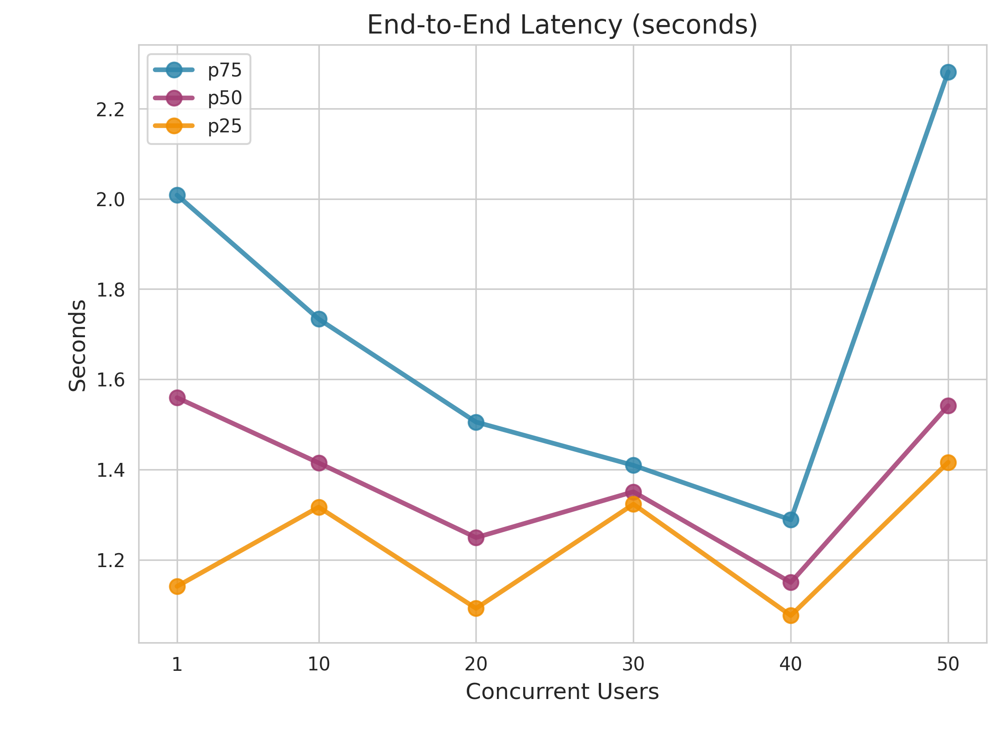

#### Time to First Token (seconds)
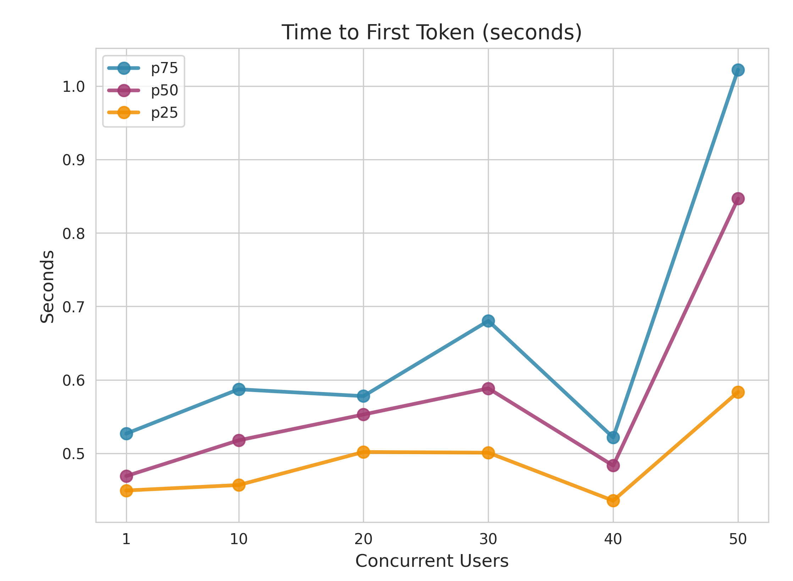

#### Output Throughput (tokens/s)
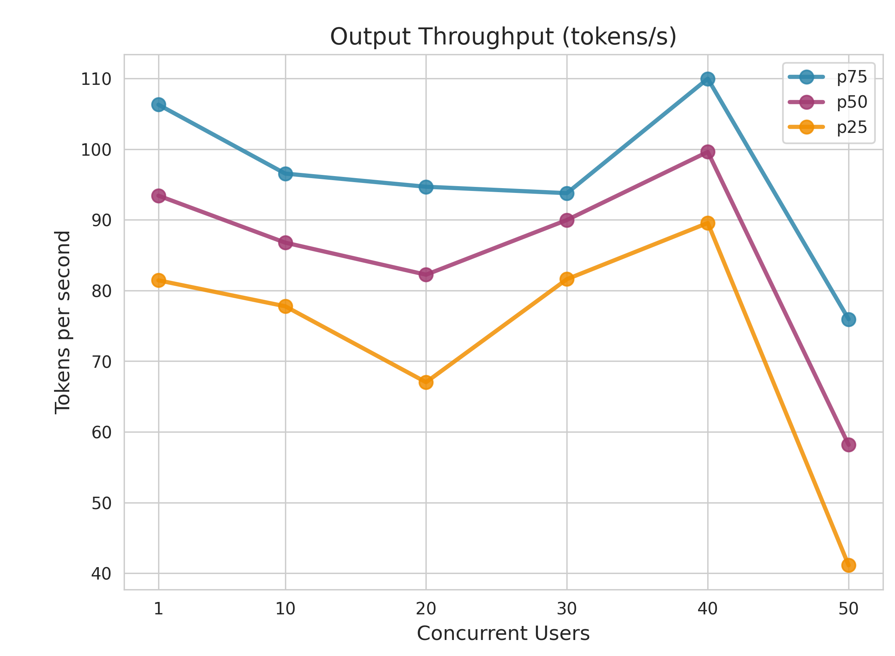

#### Full Performance Chart
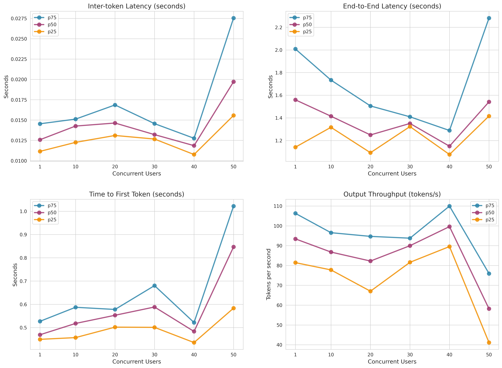

---

## 4. Use Case: Normal Conversation

### Test Configuration

| Range | Input Tokens | Output Tokens |
|---|---|---|
| Min | 100 | 200 |
| Max | 200 | 500 |
| **Mean ± Stddev** | **150 ± 25** | **350 ± 75** |

- **Cache Prevention**: Prefix caching disabled + Unique prompts enabled for accurate hardware performance measurement

### Performance Metrics

#### End-to-End Latency (seconds)

| Concurrent_Users | P25 | P50 | P75 |
| --- | --- | --- | --- |
| 1.0 | 1.122316568504175 | 1.24858219250018 | 1.724783004490746 |
| 10.0 | 1.1127227252472949 | 1.324855551996734 | 1.6059474685098394 |
| 20.0 | 1.0281290449966036 | 1.2479150510043835 | 1.3810540195045178 |
| 30.0 | 1.1570217964945186 | 1.2784421114920406 | 1.317659778505913 |
| 40.0 | 0.922204556001816 | 1.0518582250006148 | 1.1737718177428178 |
| 50.0 | 1.207610470992222 | 1.3361253375041997 | 1.4495840812560346 |

#### Inter-token Latency (seconds)

| Concurrent_Users | P25 | P50 | P75 |
| --- | --- | --- | --- |
| 1.0 | 0.0123142153437868 | 0.014063810464401 | 0.0146501107274993 |
| 10.0 | 0.0124438361006585 | 0.0135937632618985 | 0.0147482600762685 |
| 20.0 | 0.0134020457209696 | 0.015113817945527 | 0.0210420245374379 |
| 30.0 | 0.0122353258741592 | 0.0147752049060717 | 0.0164545772040496 |
| 40.0 | 0.0137530474604757 | 0.0164632585107126 | 0.0167713822418182 |
| 50.0 | 0.0150097565658374 | 0.0178864176193516 | 0.0199981034177329 |

#### Time to First Token (seconds)

| Concurrent_Users | P25 | P50 | P75 |
| --- | --- | --- | --- |
| 1.0 | 0.406875636006589 | 0.5092339984985301 | 0.5299197577442101 |
| 10.0 | 0.4057234572501329 | 0.4468507039928227 | 0.5040232682476926 |
| 20.0 | 0.4061723572594928 | 0.4913520289992448 | 0.5620624577422859 |
| 30.0 | 0.390588615246088 | 0.4386384169993107 | 0.5734481610015791 |
| 40.0 | 0.4530134845081193 | 0.546138941499521 | 0.5986587877523561 |
| 50.0 | 0.6505340114999854 | 0.7176304169988725 | 0.9508980792561488 |

#### Output Throughput (tokens/s)

| Concurrent_Users | P25 | P50 | P75 |
| --- | --- | --- | --- |
| 1.0 | 76.77234723869279 | 78.26772989937928 | 89.1857184721719 |
| 10.0 | 79.80158725500252 | 87.89608388711062 | 93.96759146274722 |
| 20.0 | 55.07037427478919 | 77.56573808772879 | 87.65411295515479 |
| 30.0 | 68.51656924389829 | 80.67760662197034 | 90.74448661739676 |
| 40.0 | 68.6648857792781 | 71.44084233787677 | 84.39012459138361 |
| 50.0 | 61.54014324275954 | 63.66477023706309 | 80.05488015549187 |

### Performance Charts

#### Inter-token Latency (seconds)
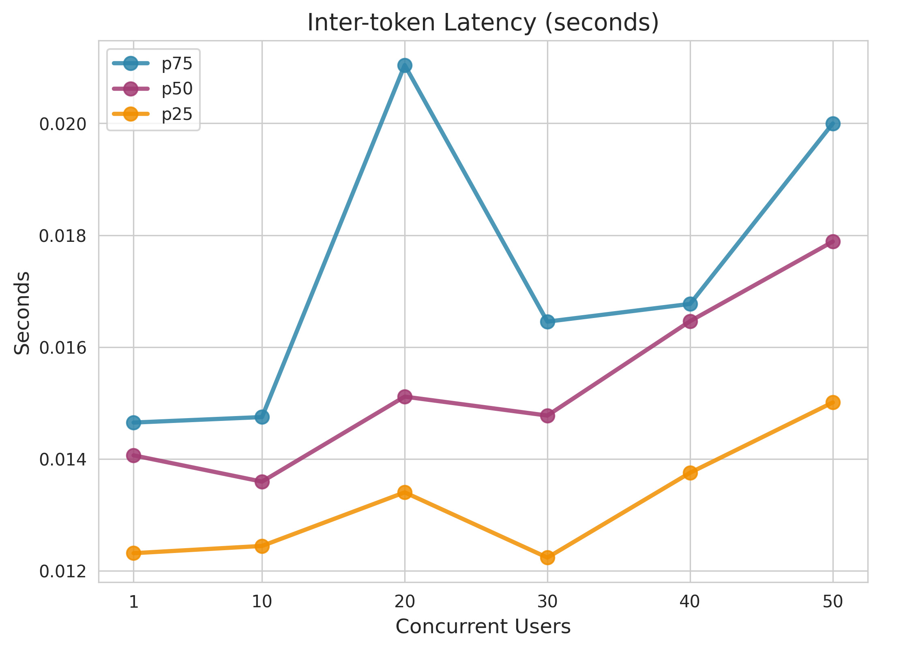

#### End-to-End Latency (seconds)
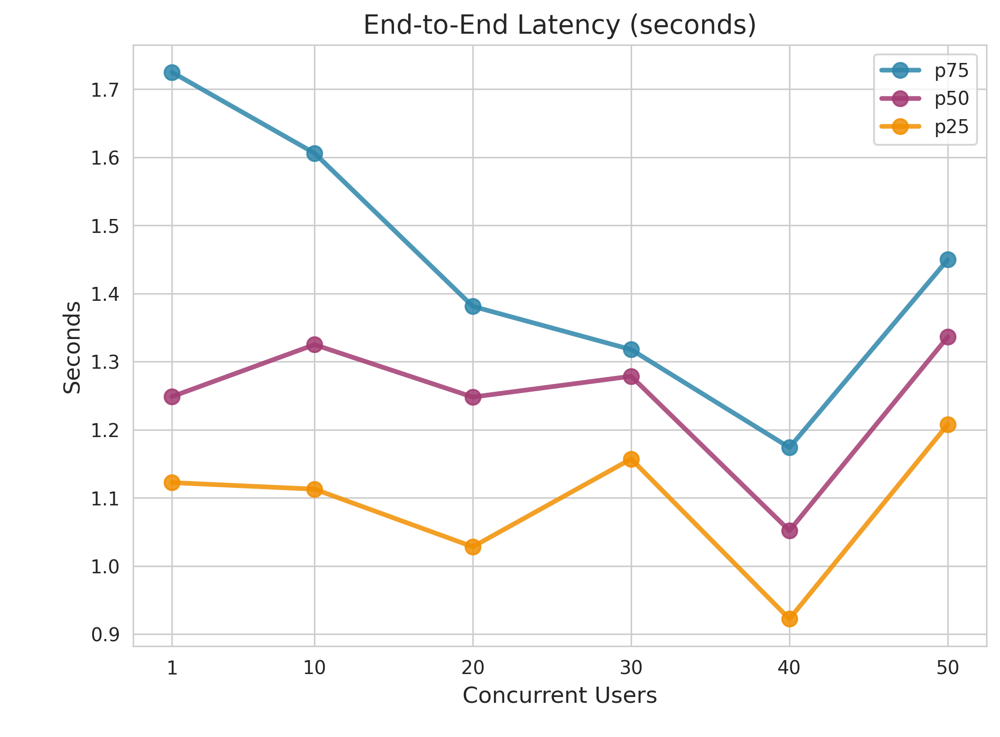

#### Time to First Token (seconds)
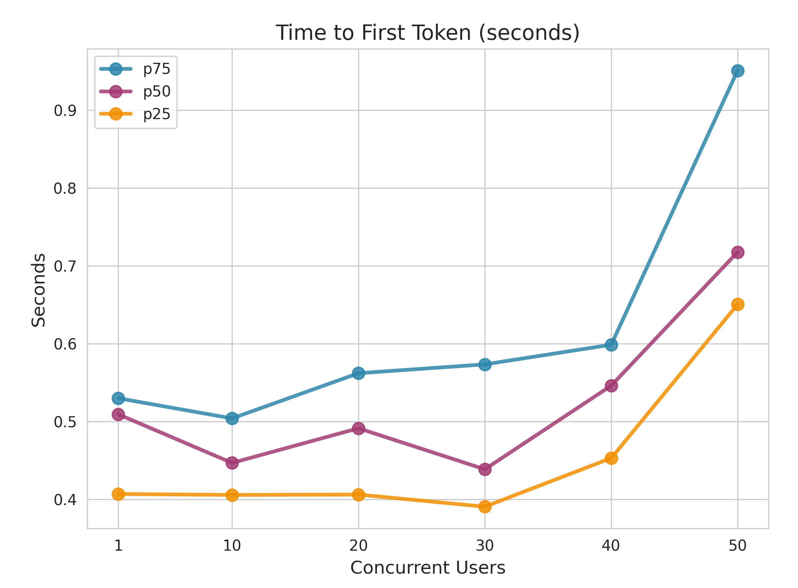

#### Output Throughput (tokens/s)

#### Full Performance Chart

---

